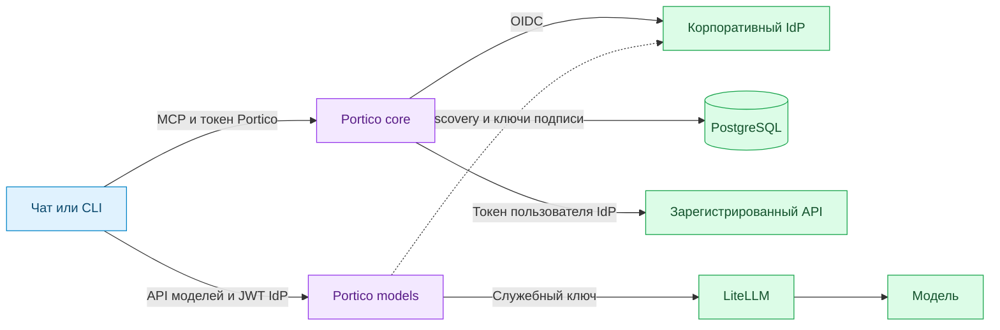

# Архитектура

## Компоненты и зависимости

| Компонент | Ответственность | Входит в чарт Portico |
| --- | --- | --- |
| core | MCP, OAuth, пользовательские сессии и реестр API | Да |
| models | Проверка JWT, права на модели, проксирование Chat Completions | Да, при `models.enabled` |
| PostgreSQL | Постоянное состояние core, общее для реплик | Нет |
| OIDC-провайдер | Учётные записи, группы, аутентификация и выпуск токенов | Нет |
| LiteLLM | Маршрутизация разрешённых запросов к моделям | Нет |
| Чат или CLI | Интерфейс пользователя, вызовы моделей и инструментов | Нет |
| Целевой API | Исполнение операций и права на объекты | Нет |

Стрелки показывают два отдельных интерфейса. Поддержка MCP в клиенте не означает, что он умеет передавать пользовательский JWT в API моделей.

## Вход для MCP

1. Клиент начинает Authorization Code flow с PKCE S256. Client ID и точный callback зарегистрированы в Portico заранее.
2. Portico направляет пользователя в IdP через собственное серверное OIDC-приложение.
3. На `/oauth/callback` проверяются состояние запроса, привязка к браузеру, токены и nonce.
4. Core сохраняет токены IdP в зашифрованной сессии PostgreSQL и выдаёт клиенту одноразовый код Portico.
5. Клиент обменивает код с PKCE verifier на собственные access и refresh tokens Portico.
6. При вызове инструмента core проверяет сессию, токен IdP и разрешения сервиса. Целевой API получает пользовательский access token IdP и проверяет права на конкретный объект самостоятельно.

Токен Portico не является токеном LiteLLM. Сессии чата, Portico и IdP независимы. Выход из чата не гарантирует отзыв сессии Portico или отмену запущенных задач.

## Доступ к моделям

Models принимает JWT пользователя, проверяет подпись, issuer, audience, срок действия и настроенные claims. Разрешённые модели вычисляются по группам. В LiteLLM отправляется отдельный служебный ключ; JWT пользователя туда не передаётся. Компонент не использует БД сессий core и не выпускает клиентам OAuth-токены.

## Пример интеграции с Strix

Core вызывает API управления Strix. Исполнители, песочницы, контроль сетевой нагрузки, восстановление задач и S3 разворачиваются отдельно. Один чат не равен одному агенту. Жизненный цикл задач определяется Strix. Ограничения целей и нагрузки должны обеспечиваться инфраструктурой исполнителя, а не текстом запроса к модели.

## Используемые реализации

MCP обслуживается Go SDK, OIDC и JWT — `go-oidc`, PostgreSQL — `pgx`, шифрование — AES-GCM стандартной библиотеки Go. Собственный код реализует связывание сессий, реестр разрешённых операций и правила доступа к моделям. Это не заменяет независимый аудит безопасности.
